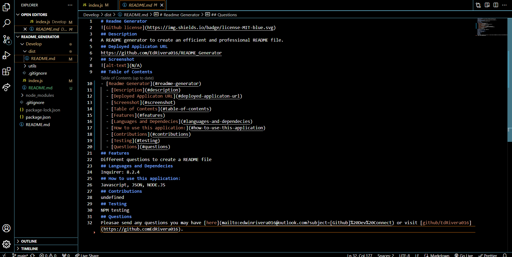

# Readme Generator

[License](https://choosealicense.com/licenses/MIT/)
## License/nThis project is license under the [MIT](https://choosealicense.com/licenses/MIT/) license.
## Description
A command line README generator to create an efficient and professional README file.
## Deployed Applicaton URL
N/A
## Screenshot
![alt-text]
## Table of Contents
- [Readme Generator](#readme-generator)
  - [License/nThis project is license under the MIT license.](#licensenthis-project-is-license-under-the-mit-license)
  - [Description](#description)
  - [Deployed Applicaton URL](#deployed-applicaton-url)
  - [Screenshot](#screenshot)
  - [Table of Contents](#table-of-contents)
  - [Features](#features)
  - [Languages and Dependecies](#languages-and-dependecies)
  - [How to use this application:](#how-to-use-this-application)
  - [Contributions](#contributions)
  - [Testing](#testing)
  - [Questions](#questions)
## Features
Question on command line to gather info to build file.
## Languages and Dependecies
inquirer 8.2.4
## How to use this application:
JAvascript, JSON, NODE.JS, Markdown
## Contributions
undefined
## Testing
NPM test(testing)
## Questions
Pleasae send any questions you may have [here](mailto:edwinrivera016@outlook.com?subject=[Github]%20Dev%20Connect) or visit [github/EdRivera016](https://github.comEdRivera016).

